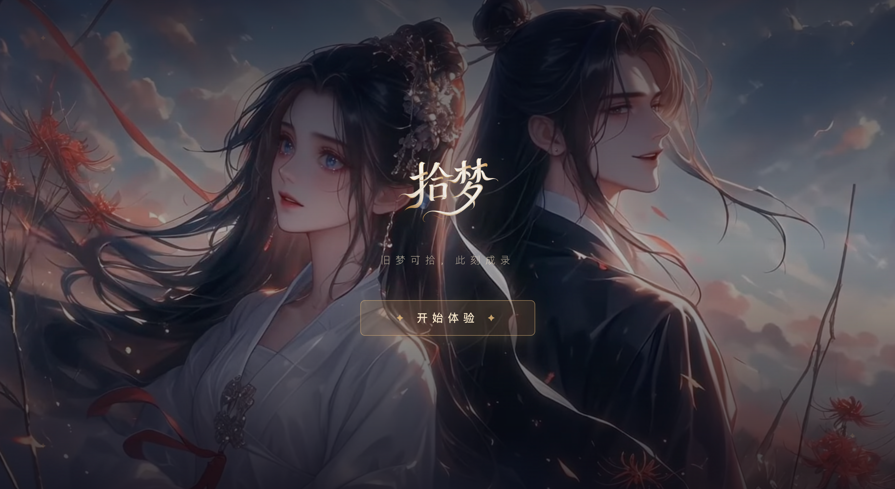

  

<h1 align="center">拾梦 · Shimeng</h1>

  <strong>CHOOSE · DRESS · DREAM</strong> 
  AI 同人图生成 · 让每个人成为古风世界的主角

  
  &nbsp;
  

  
  

 

---

## ✨ 产品简介

**拾梦录** 是一款以中国古典美学为核心的 AI 同人图生成平台，致力于让每一个人都能穿越时光，成为古风世界中的主角。

平台围绕热门 IP 剧集（现已上线《逐风玉恋》）打造沉浸式体验，提供多达 12 位精心设计的古风角色供用户选择，涵盖仙侠、宫廷、武侠等多种风格造型，画面质感细腻唯美。

用户只需三步：**选择心仪剧集 → 挑选古风角色 → 上传本人照片**，即可由 AI 将真实人像无缝融合进古风场景，生成专属同人形象。

整体视觉以大漠霞光、落花飞絮为基调，配以金丝墨韵的字体排版，将东方古典意境与现代 AI 技术完美融合。正如其品牌诗句所言——"**旧梦可拾，此刻成录**"，这里是属于每位古风爱好者的梦境入口。

 

## 🎬 产品截图

  
   
  <b>AI 同人图生成 · 让每个人成为古风世界的主角</b>

 

## 🪐 立即体验

**🌐 官网体验：[www.shimeng.asia](https://www.shimeng.asia/)**

无需安装 · 网页直达

 

## 🛸 关于 Innate Labs

> **Building AI-native products & agents for the next generation of founders.**

[Innate Labs](https://github.com/Innate-Labs) 致力于打造下一代 AI 原生产品与智能体（Agents）。

- 🌐 GitHub：<https://github.com/Innate-Labs>
- 🪐 产品官网：<https://www.shimeng.asia/>

 

---

  
    © 2026 <a href="https://github.com/Innate-Labs"><b>Innate Labs</b></a> &nbsp;·&nbsp;
    Crafted with 🌊 and ✨ AI &nbsp;·&nbsp;
    <a href="https://www.shimeng.asia/">www.shimeng.asia</a>
  

